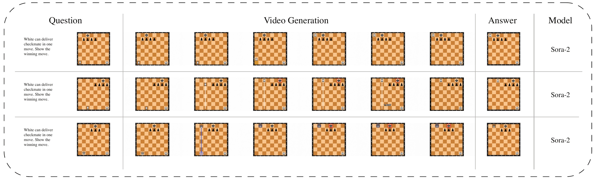
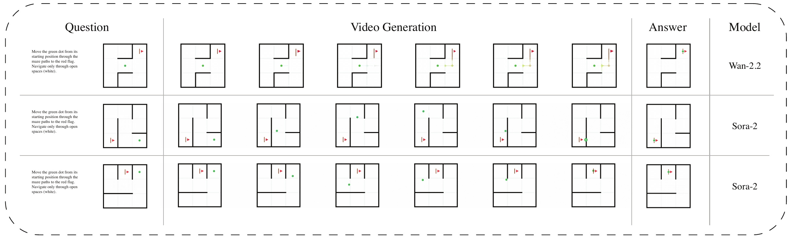
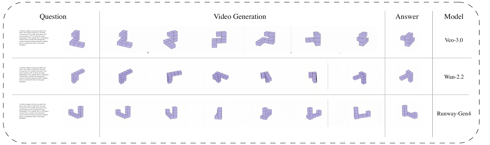
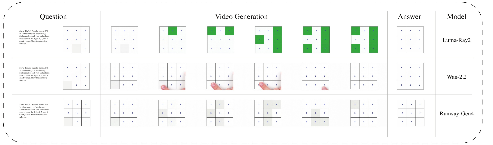
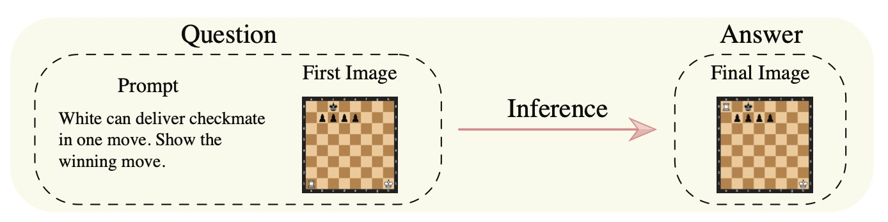

# VMEvalKit 🎥🧠

A framework to score reasoning capabilities in video generation models at scale, through cognitive tasks. We **make it very convenient** to [**add models**](docs/ADDING_MODELS.md), [**add tasks**](docs/ADDING_TASKS.md), [**run inferences**](docs/INFERENCE.md), [**run scoring**](docs/SCORING.md), [**manage datasets**](docs/DATA_MANAGEMENT.md) and [**display results**](https://grow-ai-like-a-child.com/video-reason/). It's **permissively open-source**, and we welcome everyone to [**join**](https://join.slack.com/t/growingailikeachild/shared_invite/zt-309yqd0sl-W8xzOkdBPha1Jh5rnee78A) us and **build in public together**! 🚀 


<p align="center">
    <a href="asset/leaderboard.html">🏆 Leaderboard (Under Construction)</a> •
    <a href="https://grow-ai-like-a-child.com/video-reason/">🔍 Preliminary results</a> 
</p>


## 🎬 Supported Models

VMEvalKit provides unified access to **40 video generation models** across **11 provider families**:

### Commercial APIs (32 models)

| Provider | Models | Key Features | 
|----------|---------|-------------|
| **Luma Dream Machine** | 2 | `luma-ray-2`, `luma-ray-flash-2` | 
| **Google Veo** | 3 | `veo-2.0-generate`, `veo-3.0-generate`, `veo-3.0-fast-generate` | 
| **Google Veo 3.1** | 4 | Native 1080p, audio generation (via WaveSpeed) | 
| **WaveSpeed WAN 2.1** | 8 | 480p/720p variants with LoRA and ultra-fast options | 
| **WaveSpeed WAN 2.2** | 10 | Enhanced 5B models, improved quality | 
| **Runway ML** | 3 | Gen-3A Turbo, Gen-4 Turbo, Gen-4 Aleph | 
| **OpenAI Sora** | 2 | Sora-2, Sora-2-Pro (4s/8s/12s durations) | 

### Open-Source Models

| Provider | Models | Key Features | Hardware Requirements |
|----------|---------|-------------|----------------------|
| **HunyuanVideo** | 1 | High-quality 720p I2V | GPU with 24GB+ VRAM |
| **VideoCrafter** | 1 | Text-guided video synthesis | GPU with 16GB+ VRAM |
| **DynamiCrafter** | 3 | 256p/512p/1024p, image animation | GPU with 12-24GB VRAM |
| **Stable Video Diffusion** | 1 | Video generation | GPU with 16GB+ VRAM |
| **Morphic** | 1 | Video generation | GPU with 16GB+ VRAM |
| **LTX-Video** | 1 | Video generation | GPU with 16GB+ VRAM |

## 📊 Supported Datasets

VMEvalKit provides access to **3 external benchmark datasets** and **6 local task generation engines**:

### External Benchmarks (HuggingFace)

| Dataset | Tasks | Domains | Key Features |
|---------|-------|---------|--------------|
| **VideoThinkBench** | ~4,000 | 4 subsets | Vision-centric (ARC-AGI, Eyeballing, Visual Puzzles) + Text-centric reasoning |
| **MME-CoF** | 59 | 16 domains | Video Chain-of-Frame reasoning across cognitive domains |

**VideoThinkBench Subsets:**
- `arc_agi_2` - Abstract reasoning (1,000 tasks)
- `eyeballing_puzzles` - Visual estimation (1,050 tasks)  
- `visual_puzzles` - Pattern recognition (496 tasks)
- `text_centric_tasks` - Math & multimodal reasoning (1,453 tasks)

### Local Task Generation Engines

| Task | Description | Generation Method |
|------|-------------|-------------------|
| **Chess** | Strategic thinking & tactical patterns | Chess engine with mate-in-1 puzzles |
| **Maze** | Path-finding & navigation | Procedural maze generation (Kruskal's algorithm) |
| **Raven** | Abstract reasoning matrices | RAVEN dataset patterns |
| **Rotation** | 3D mental rotation | Procedural 3D object generation |
| **Sudoku** | Logical constraint satisfaction | Sudoku puzzle generator |
| **Object Subtraction** | Selective object removal | Multi-level cognitive reasoning |

All tasks follow the unified **First Frame → Final Frame** format with text prompts, enabling consistent evaluation across diverse reasoning domains.

### Basic Idea

VMEvalKit aims to provide an infrastructure for reasoning research in video models at scale:

- 🎯  [**Task Creation at Scale**](docs/ADDING_TASKS.md): Create question dataset of many different cognitive tasks programmatically at scale and our framework makes sure the dataset to be well-organized.
- 🚀  [**Model Inference at Scale**](docs/INFERENCE.md): Easy one-click inference of the entire question dataset across many video models (commercial APIs + open-source) with automatic resume, error handling, and structured output management, and automatically sync the inference results into the dataset. 
- ⚖️  [**Scoring Pipeline**](docs/SCORING.md): Human scoring via web interface and AI scoring via automated MLLM scoring, also automatically sync the scoring results into the dataset. 
- ☁️  [**Dataset Management**](docs/DATA_MANAGEMENT.md): Manage question datasets from task creation, inference results from video models, and scoring results from humans or MLLM pipelines. Provides AWS S3 integration with version tracking and built-in logging for reproducibility. 

We have completed running a question dataset of [**chess**](/vmevalkit/tasks/chess_task/CHESS.md), [**maze**](/vmevalkit/tasks/maze_task/MAZE.md), [**Sudoku**](/vmevalkit/tasks/sudoku_task/SUDOKU.md), [**mental rotation**](/vmevalkit/tasks/rotation_task/ROTATION.md), and [**Raven's Matrices**](/vmevalkit/tasks/raven_task/RAVEN.md) on [**latest video models**](https://grow-ai-like-a-child.com/video-reason/). Checkout our raw results videos on this [**website**](https://grow-ai-like-a-child.com/video-reason/). Here are a few examples.

## Installation & Setup

1. **Clone the repository**
```bash
git clone https://github.com/hokindeng/VMEvalKit.git
cd VMEvalKit
```

2. **Initialize submodules** - good for optional open-source models and datasets
```bash
git submodule update --init --recursive
```

3. **Configure environment** - Copy the example environment file and add your API keys
```bash
cp env.template .env
```

4. **Set up Python environment** – Recommended: use a fresh virtual environment

```bash
python -m venv venv
source venv/bin/activate
```

Alternatively, you can use other tools like [`uv`](https://github.com/astral-sh/uv) for faster install (`uv venv`), or [`conda`](https://docs.conda.io/) if your usecase has cross-language dependencies.

5. **Install dependencies:**

```bash
pip install -r requirements.txt
pip install -e .
```

For open-source video generation and evaluator models, please refer to [**Open Source Models**](./examples/opensource/open_source.md) for detailed installation instructions.

## 🚀 Quick Start - End-to-End Example

Here's a complete workflow from creating questions to scoring results:

### 1️⃣ Create Questions
```bash
# Generate 5 chess and maze questions each
python examples/create_questions.py --task chess maze --pairs-per-domain 5

# Output: Creates data/questions/ with chess_task/ and maze_task/ folders
```

### 2️⃣ Generate Videos
```bash
# List available models
python examples/generate_videos.py --list-models

# set Luma key in .env file 
# Run on specific model (e.g., Luma Ray 2)
python examples/generate_videos.py --model luma-ray-2 --task chess maze

# Output: Creates data/outputs/pilot_experiment/ with generated videos
```

### 3️⃣ Score Results
```bash
# Option A: Human scoring via web interface
python examples/score_videos.py human

# Option B: Automated GPT-4O scoring
python examples/score_videos.py gpt4o
```

### 4️⃣ View Results
```bash
# Launch web dashboard to explore results
cd web && ./start.sh
# Open http://localhost:5000 in your browser
```

### 5️⃣ (Optional) Sync with Cloud
```bash
# AWS S3 (enterprise backup)
python data/s3_sync.py --log
```

That's it! You now have:
- ✅ Custom reasoning questions in `data/questions/`  
- ✅ Generated videos in `data/outputs/`
- ✅ Scoring results in `data/scorings/`
- ✅ Interactive dashboard to explore everything

**Tips:**
- Start small: `--pairs-per-domain 2` for quick testing
- Use `--task-id chess_0001` to run specific questions  
- Try different models: `--model openai-sora-2 veo-3.0-generate`

## Examples

Solving Chess



Solving Maze



Mental Rotation



Raven's Matrices


Sudoku Solving



## Tasks

Every VMEvalKit dataset consists of **Task Pairs** - the basic unit for video reasoning scoring:

Each Task Pair consists of three core components:
- 📸 **Initial state image** (`first_frame.png`): shows the starting point or problem to be solved
- 🎯 **Final state image** (`final_frame.png`): illustrates the goal state or solution  
- 📝 **Text prompt** (`prompt.txt`): provides natural language instructions for the video model

There is also an accompanying `question_metadata.json` file with rich metadata. Each task pair is organized in its own folder (`data/questions/{domain}_task/{question_id}/`) containing all four files. 



## Inference Architecture

### 🚀 Quick Start

```python
from vmevalkit.runner.inference import InferenceRunner

# Initialize runner - creates structured output directories
runner = InferenceRunner(output_dir="data/outputs")

# Generate video showing reasoning process
result = runner.run(
    model_name="luma-ray-2",
    image_path="data/questions/maze_task/maze_0000/first_frame.png",
    text_prompt="Navigate the green dot through the maze corridors to reach the red flag",
    question_data={"id": "maze_0000", "domain": "maze"}  # Optional metadata
)

# Each inference creates a self-contained output folder:
print(f"📁 Output folder: {result['inference_dir']}")
# Contains:
# ├── video/generated_video.mp4    # The generated video
# ├── question/                    # Input data archive
# │   ├── first_frame.png         # Input image
# │   ├── prompt.txt              # Text prompt
# │   └── question_metadata.json  # Task metadata
# └── metadata.json               # Complete inference record
```

### 🏗️ System Design

```
┌─────────────────────────────────────────────────────────────────────────────┐
│                               InferenceRunner                               │
│        Top-level orchestrator: manages workflow, batching, and output       │
└───────────────────────┬─────────────────────────────────────────────────────┘
                        │      Dynamic Model Loading (importlib)              
                        ▼                                                    
┌─────────────────────────────────────────────────────────────────────────────┐
│                              MODEL_CATALOG                                  │
│  Unified model registry:                                                    │
│    - Lists all available models (both API and open-source)                  │
│    - Records provider family, wrapper paths, model meta-info                │
│    - No imports of implementations (pure config)                            │
└───────────────────────┬─────────────────────────────────────────────────────┘
                        │      importlib.import_module() dynamically loads   
                        ▼
┌─────────────────────────────────────────────────────────────────────────────┐
│                       Model Implementations (Two Flavors)                   │
│ ┌────────────────────────────┬────────────────────────────────────────────┐ │
│ │          Commercial Models             │      Open-Source Models        │ │
│ │       (Closed Source Services)         │    (Local Implementations)     │ │
│ ├────────────────────────────┼────────────────────────────────────────────┤ │
│ │ LumaWrapper  +  LumaService           │ LTXVideoWrapper  +  LTXService  │ │
│ │ VeoWrapper   +  VeoService            │ HunyuanWrapper   +  HunyuanSvc  │ │
│ │ RunwayWrapper+  RunwayService         │ VideoCrafterWrapper+VCService   │ │
│ │ ...                                   │ DynamiCrafterWrapper+DynService │ │
│ └────────────────────────────┴────────────────────────────────────────────┘ │
│   - Each Wrapper implements unified VMEvalKit interface                     │
│   - API Services handle endpoints, retries, S3-upload (when needed)         │
│   - Open-source backends directly invoke local model code                   │
└─────────────────────────────────────────────────────────────────────────────┘
```
See **[Inference Guide](docs/INFERENCE.md)** for details. 

## Scoring Pipeline

### Example Usage

```bash
# Create questions for specific domains
python examples/create_questions.py --task chess maze --pairs-per-domain 10

# Generate videos with selected models  
python examples/generate_videos.py --model luma-ray-2 veo-3.0-generate --task chess maze

# Score results
python examples/score_videos.py human
python examples/score_videos.py gpt4o

# Using runner modules directly
python -m vmevalkit.runner.score human \
  --experiment pilot_experiment \
  --annotator "John Doe" \
  --port 7860 --share

python -m vmevalkit.runner.score gpt4o \
  --experiment pilot_experiment \
  --output-dir data/scorings \
  --temperature 0.1 
```

Use as Python Modules

```python
from vmevalkit.eval import HumanScorer

scorer = HumanScorer(experiment_name="pilot_experiment")
scorer.launch_interface(share=True, port=7860)
```

See **[Scoring Guide](docs/SCORING.md)** for details.

## Dataset Management

### Dataset Structure

VMEvalKit uses a hierarchical structure for organizing all data:

```
data/
├── questions/                       # Task datasets
│   ├── vmeval_dataset.json         # Master dataset manifest
│   ├── chess_task/                 # Chess puzzles (mate-in-1 scenarios)
│   │   └── chess_0000/
│   │       ├── first_frame.png     # Initial chess position
│   │       ├── final_frame.png     # Solution position
│   │       ├── prompt.txt          # Move instructions
│   │       └── question_metadata.json  # Task metadata
│   ├── maze_task/                  # Maze solving challenges
│   ├── raven_task/                 # Raven's progressive matrices
│   ├── rotation_task/              # 3D mental rotation
│   └── sudoku_task/                # Sudoku puzzles
│
├── outputs/                         # Model inference results
│   └── pilot_experiment/           # Experiment name
│       └── <model_name>/           # e.g., openai-sora-2, luma-ray-2
│           └── <domain>_task/      # e.g., chess_task
│               └── <task_id>/      # e.g., chess_0000
│                   └── <run_id>/   # Timestamped run folder
│                       ├── video/
│                       │   └── model_output.mp4
│                       ├── question/
│                       │   ├── prompt.txt
│                       │   └── first_frame.png
│                       └── metadata.json
│
├── scorings/                        # Scoring results
│   └── pilot_experiment/
│       └── <model_name>/
│           └── <domain>_task/
│               └── <task_id>/
│                   ├── human-score.json     # Human scoring scores
│                   └── GPT4OScorer.json     # GPT-4O scoring scores
│
└── data_logging/                    # Version tracking
    ├── version_log.json            # Version history
    └── versions/                   # Version snapshots
```

### Synchronization

Upload your dataset to S3:

```bash
# AWS S3
python data/s3_sync.py --log  # Upload with version logging
python data/s3_sync.py --date 20250115  # Upload with specific timestamp
```

See **[Data Management](docs/DATA_MANAGEMENT.md)** for details. 

## Display Results

You could quickly host your results on an interactive dashboard at: http://localhost:5000

```bash
# Navigate to web directory
cd web

# Option 1: Use startup script (recommended)
./start.sh

# Option 2: Manual startup
source ../venv/bin/activate
python app.py
```
See **[Web Dashboard](docs/WEB_DASHBOARD.md)** for details.

## Add Models or Tasks

You can add new video generation models and reasoning tasks with minimal effort:

**Adding New Models**

Add any video generation model (API-based or open-source) with just a few steps:

```python
# Example: Adding a new model wrapper
from vmevalkit.models.base import BaseVideoModel

class MyModelWrapper(BaseVideoModel):
    def generate_video(self, image_path, text_prompt, **kwargs):
        # Your model's video generation logic
        return video_path
```

Then register it in `MODEL_CATALOG.py`:
```python
"my-model": {
    "provider": "mycompany",
    "wrapper_path": "vmevalkit.models.my_model.MyModelWrapper",
    ...
}
```

See **[Adding Models Guide](docs/ADDING_MODELS.md)** for details.

**Adding New Tasks**

Create new reasoning tasks programmatically at scale:

```python
from vmevalkit.tasks.base_task import BaseTask

class MyTask(BaseTask):
    def generate_task_pair(self, ...):
        # Generate initial and final states
        initial_state = self.create_initial_state()
        final_state = self.create_final_state()
        prompt = self.create_prompt()
        
        return {
            "first_frame": initial_state,
            "final_frame": final_state, 
            "prompt": prompt,
            "metadata": {...}
        }
```

VMEvalKit handles all the dataset organization, inference pipelines, and evaluation infrastructure automatically.

See **[Adding Tasks Guide](docs/ADDING_TASKS.md)** for details.

## Invitation to Collaborate 🤝

VMEvalKit is meant to be a permissively open-source **shared playground** for everyone. If you’re interested in machine cognition, video models, evaluation, or anything anything 🦄✨, we’d love to build with you:

* 🧪 Add new reasoning tasks (planning, causality, social, physical, etc.)
* 🎥 Plug in new video models (APIs or open-source)
* 📊 Experiment with better evaluation metrics and protocols
* 🧱 Improve infrastructure, logging, and the web dashboard
* 📚 Use VMEvalKit in your own research and share back configs/scripts
* 🌟🎉 Or Anything anything 🦄✨

💬 **Join us on Slack** to ask questions, propose ideas, or start a collab:
[Slack Invite](https://join.slack.com/t/growingailikeachild/shared_invite/zt-309yqd0sl-W8xzOkdBPha1Jh5rnee78A) 🚀

## Documentation

📚 **Core Documentation:**
- **[Inference Guide](docs/INFERENCE.md)** - Complete guide to running inference, supported models, and architecture
- **[Scoring Guide](docs/SCORING.md)** - Human and automated scoring methods
- **[Data Management](docs/DATA_MANAGEMENT.md)** - Dataset organization, S3 sync, and version tracking
- **[Adding Models](docs/ADDING_MODELS.md)** - How to add new video generation models
- **[Adding Tasks](docs/ADDING_TASKS.md)** - How to create new reasoning tasks
- **[Web Dashboard](docs/WEB_DASHBOARD.md)** - Interactive results visualization

## Research

Here we keep track of papers spinned off from this code infrastructure and some works in progress.

- [**"Video Models Start to Solve Chess, Maze, Sudoku, Mental Rotation, and Raven's Matrices"**](paper/video-models-start-to-solve/Video_Model_Start_to_Solve.pdf)

This paper implements our experimental framework and demonstrates that leading video generation models (Sora-2 etc) can perform visual reasoning tasks with >60% success rates. See [**results**](https://grow-ai-like-a-child.com/video-reason/).

## License

Apache 2.0