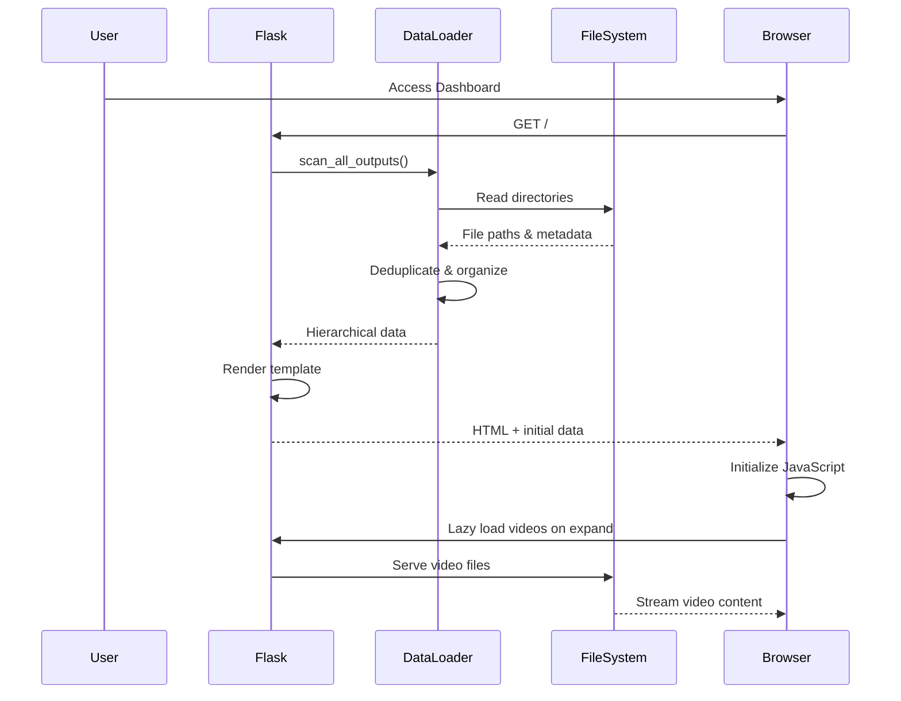

# VMEvalKit Web Dashboard 🎥

A modern, production-ready web application for visualizing and exploring video generation results from VMEvalKit experiments, featuring hierarchical organization, lazy loading, comprehensive security, and accessibility support.

## 🚀 Quick Start

```bash
# Navigate to web directory
cd web

# Option 1: Use startup script (recommended)
./start.sh

# Option 2: Manual startup
source ../venv/bin/activate
python app.py
```

**Access the dashboard at:** http://localhost:5000

## 📊 Overview

The web dashboard provides a comprehensive interface for exploring video generation results with:

### Core Features
- **📊 Hierarchical Dashboard**: Three-level organization (Models → Domains → Tasks)
- **🤖 Model Performance**: Collapsible sections with task counts and metadata
- **🧠 Domain Grouping**: Visual icons for each reasoning domain
- **🎬 Smart Video Playback**: Lazy loading with progressive enhancement
- **📷 Media Display**: Input images, prompts, and generated videos
- **🚀 Multi-level Navigation**: Quick jump buttons, dropdowns, and direct links
- **🔍 REST API**: Full programmatic access to all results
- **📱 Responsive Design**: Optimized for desktop, tablet, and mobile
- **♿ Accessibility**: WCAG 2.1 AA compliant with keyboard navigation
- **🔒 Security**: Multi-layer protection against common web vulnerabilities
- **⚡ Performance**: LRU caching, lazy loading, and optimized queries

## 🏗️ Architecture

### System Design

```
┌─────────────────────────────────────────────────────────┐
│                    Web Dashboard                         │
├─────────────────────────────────────────────────────────┤
│  Frontend Layer                                          │
│  ├── HTML Templates (Jinja2)                           │
│  │   ├── base.html      - Layout & navigation          │
│  │   ├── index.html     - Dashboard with JS            │
│  │   └── error.html     - Error handling               │
│  ├── JavaScript (Vanilla)                              │
│  │   └── main.js        - Interactive features         │
│  └── CSS (Apple Design)                                │
│      └── style.css      - Clean minimal theme          │
├─────────────────────────────────────────────────────────┤
│  Backend Layer (Flask)                                   │
│  ├── app.py                                             │
│  │   ├── Routes         - /, /api/results, /video/*, /image/*
│  │   ├── Security       - Path traversal protection    │
│  │   ├── Middleware     - ProxyFix for deployment      │
│  │   └── Filters        - datetime, duration, file_size│
│  └── utils/data_loader.py                              │
│      ├── scan_all_outputs()    - Filesystem scanner    │
│      ├── get_hierarchical_data() - Data organization   │
│      └── load_run_information()  - Metadata loading    │
├─────────────────────────────────────────────────────────┤
│  Data Layer                                             │
│  └── Filesystem                                         │
│      ├── data/outputs/pilot_experiment/                │
│      └── data/questions/                               │
└─────────────────────────────────────────────────────────┘
```

### Component Details

#### Backend Components

**Flask Application (`app.py`)**
- **Configuration**: Environment-based settings with secure defaults
- **Middleware**: ProxyFix for reverse proxy deployments
- **Security**: 
  - Path traversal protection with `safe_join()`
  - Input validation and sanitization
  - File extension whitelisting
  - Directory access restrictions
  - Max file size limits (16MB)
  - Secret key management
- **Template Filters**:
  - `datetime_format`: ISO to human-readable dates
  - `duration_format`: Seconds to "2h 15m" format
  - `file_size`: Bytes to KB/MB/GB display
- **Error Handling**: Comprehensive logging and user-friendly error pages

**Data Loader (`utils/data_loader.py`)**
- **Filesystem Scanner**: Recursive directory traversal with validation
- **Deduplication**: Automatic selection of most recent runs
- **Caching**: LRU cache for scan results (`@lru_cache(maxsize=1)`)
- **Data Organization**: Hierarchical structuring for UI display
- **Metadata Loading**: JSON parsing from inference logs
- **Statistics**: Model and domain aggregation functions

#### Frontend Components

**JavaScript (`static/js/main.js`)**
```javascript
// Core modules initialized on page load:
initializeVideoPlayers()     // Click-to-play, keyboard support
initializeFilters()          // Table filtering
initializeSearch()           // Global search with debouncing
initializeLazyLoading()      // Progressive video loading
initializeAccessibility()    // ARIA, skip links, focus management
initializeProgressBars()     // Animated completion indicators
```

**Key JavaScript Features**:
- **Video Management**:
  - Three-stage loading: none → metadata → auto
  - IntersectionObserver for viewport detection
  - Error handling with fallback UI
  - Loading states and animations
- **Accessibility**:
  - Skip-to-main-content link
  - ARIA live regions for announcements
  - Keyboard focus tracking
  - Screen reader optimizations
- **Utilities**:
  - Debounce function for search
  - Clipboard API with fallback
  - Toast notifications
  - Table sorting
  - Keyboard shortcuts (Ctrl+K for search, Esc to clear)

**CSS Design System (`static/css/style.css`)**
- **Design Philosophy**: Apple HIG-inspired clean minimalism
- **Color System**:
  ```css
  --primary: #000000;      /* Main text and borders */
  --secondary: #666666;    /* Secondary elements */
  --bg: #ffffff;          /* Primary background */
  --bg-secondary: #f5f5f7; /* Section backgrounds */
  --info: #007aff;        /* Interactive elements */
  --success: #34c759;     /* Success states */
  --error: #ff3b30;       /* Error states */
  ```
- **Components**: Cards, badges, buttons, progress bars, notifications
- **Responsive Breakpoints**: 768px for mobile/tablet transition
- **Animations**: Slide-in notifications, progress bar fills, hover effects

### Data Flow



## 📁 Data Source Structure

The dashboard scans this exact directory structure:

```
data/
├── outputs/
│   └── pilot_experiment/
│       └── {model_name}/           # e.g., "luma-ray-2"
│           └── {domain}_task/      # e.g., "chess_task"
│               └── {task_id}/       # e.g., "chess_0001"
│                   └── {run_id}/    # e.g., "luma-ray-2_chess_0001_20241017_143022"
│                       ├── question/
│                       │   ├── prompt.txt           # Text prompt for the task
│                       │   ├── first_frame.png      # Input image
│                       │   ├── final_frame.png      # Expected output (optional)
│                       │   └── question_metadata.json # Task metadata (optional)
│                       ├── video/
│                       │   └── *.mp4               # Generated video (mp4/webm/avi/mov)
│                       └── metadata.json           # Generation metadata
└── questions/                      # Fallback for input images
```

### Deduplication Logic

When multiple runs exist for the same `(model, domain, task_id)` tuple:
1. Runs are sorted by modification timestamp (newest first)
2. Only the most recent run is displayed
3. Duplicate count is logged for debugging

## 🔌 API Reference

### GET `/api/results`

Retrieve inference results with optional filtering.

**Query Parameters:**
| Parameter | Type | Description | Example |
|-----------|------|-------------|---------|
| `model` | string | Filter by model name | `luma-ray-2` |
| `domain` | string | Filter by domain | `chess`, `maze`, `raven` |
| `task_id` | string | Filter by task ID | `chess_0001` |

**Response Schema:**
```json
{
  "total": 450,
  "results": [
    {
      "run_id": "wavespeed-wan-2.2-i2v-720p_chess_0001_20251017_071644",
      "model": "wavespeed-wan-2.2-i2v-720p",
      "domain": "chess",
      "task_id": "chess_0001",
      "timestamp": "2024-10-17T07:16:44",
      "prompt": "Move the white knight to capture the black queen...",
      "video_path": "/path/to/generated/video.mp4",
      "first_frame": "/path/to/input/image.png",
      "final_frame": "/path/to/expected/output.png",
      "inference_dir": "/full/path/to/run/directory"
    }
  ]
}
```

**Example Requests:**
```bash
# Get all results
curl http://localhost:5000/api/results

# Filter by model
curl "http://localhost:5000/api/results?model=luma-ray-2"

# Filter by domain
curl "http://localhost:5000/api/results?domain=chess"

# Combined filters
curl "http://localhost:5000/api/results?model=veo-3.1-720p&domain=maze"
```

**Error Responses:**
- `400 Bad Request`: Invalid query parameters
- `500 Internal Server Error`: Server-side error

### GET `/video/<path>`

Stream video files with range request support.

**Features:**
- Conditional requests for efficient streaming
- MIME type detection
- Path traversal protection
- Supported formats: MP4, WebM, AVI, MOV

### GET `/image/<path>`

Serve image files from outputs or questions directory.

**Features:**
- Dual directory search (outputs first, then questions)
- Format validation (PNG, JPG, JPEG, GIF, WebP, BMP)
- Security validation

## ⚡ Performance Optimizations

### Video Loading Strategy

**Three-Stage Progressive Enhancement:**

1. **Initial State** (`preload="none"`):
   - No video data loaded
   - Minimal bandwidth usage
   - Instant page load

2. **Section Expanded** (`preload="metadata"`):
   ```javascript
   videos.forEach(video => {
       video.preload = 'metadata';
   });
   ```
   - Loads video duration and dimensions
   - Enables progress bar display
   - Still bandwidth-efficient

3. **Near Viewport** (`preload="auto"`):
   ```javascript
   const observer = new IntersectionObserver(entries => {
       entries.forEach(entry => {
           if (entry.isIntersecting) {
               entry.target.preload = 'auto';
           }
       });
   }, { rootMargin: '100px' });
   ```
   - Full video buffering
   - Ready for instant playback
   - Triggered 100px before viewport

### Caching Strategy

- **LRU Cache**: Scan results cached for session
- **Browser Caching**: Static assets with appropriate headers
- **Conditional Requests**: Video streaming with ETag support

### Performance Metrics

Typical load times (75 tasks, 6 models):
- Initial page load: < 500ms
- Section expand: < 100ms
- Video metadata load: < 200ms
- Full video buffer: 1-3s (depends on size)

## 🔒 Security Features

### Path Traversal Protection

```python
# Multiple layers of protection
if '..' in path or path.startswith('/'):
    abort(403)

safe_path = safe_join(OUTPUT_DIR, path)
if not safe_path:
    abort(403)

if not str(full_path).startswith(str(OUTPUT_DIR)):
    abort(403)
```

### Input Validation

- Parameter sanitization for API endpoints
- File extension whitelisting
- Directory access restrictions
- Maximum file size limits

### Security Headers

```python
# ProxyFix middleware for secure proxy deployments
app.wsgi_app = ProxyFix(app.wsgi_app, 
                        x_for=1, x_proto=1, 
                        x_host=1, x_prefix=1)

# Secret key management
app.config['SECRET_KEY'] = os.environ.get('SECRET_KEY', 
                                          os.urandom(24))
```

## ♿ Accessibility Features

### WCAG 2.1 AA Compliance

- **Keyboard Navigation**: Full keyboard support with visible focus indicators
- **Screen Readers**: ARIA labels, live regions, semantic HTML
- **Skip Links**: "Skip to main content" for keyboard users
- **Focus Management**: Intelligent focus tracking and restoration
- **Color Contrast**: Meets WCAG AA standards (4.5:1 minimum)
- **Error Handling**: Clear error messages with context

### Keyboard Shortcuts

| Shortcut | Action |
|----------|--------|
| `Tab` | Navigate forward |
| `Shift+Tab` | Navigate backward |
| `Enter/Space` | Activate buttons/videos |
| `Ctrl/Cmd+K` | Focus search |
| `Escape` | Clear search |

## 🎨 UI/UX Features

### Navigation System

**Three-Level Navigation:**
1. **Quick Jump Buttons**: Direct access to any model
2. **Dropdown Menus**: Model → Task selection
3. **Hierarchical Sections**: Click to expand/collapse

### Visual Design

- **Apple-inspired Design**: Clean, minimal, focused
- **Domain Icons**: Visual recognition
  - ♟️ Chess
  - 🌀 Maze
  - 🧩 Raven
  - 🔄 Rotation
  - 🔢 Sudoku
- **Status Indicators**: Success/error states, loading animations
- **Hover Effects**: Interactive feedback for all clickable elements

### Responsive Breakpoints

| Screen Size | Layout |
|------------|--------|
| > 768px | Multi-column grid, side-by-side content |
| ≤ 768px | Single column, stacked navigation |

## 🚀 Deployment

### Development Mode

```bash
export FLASK_DEBUG=true
export FLASK_HOST=0.0.0.0
export FLASK_PORT=5000
python app.py
```

### Production with Gunicorn

```bash
# Install production dependencies
pip install gunicorn

# Run with multiple workers
gunicorn --bind 0.0.0.0:5000 \
         --workers 4 \
         --worker-class sync \
         --timeout 300 \
         --access-logfile - \
         --error-logfile - \
         app:app
```

### Environment Variables

```bash
# Required for production
export SECRET_KEY="your-secure-random-key-here"
export FLASK_DEBUG=false

# Optional configuration
export FLASK_HOST=0.0.0.0
export FLASK_PORT=5000
export OUTPUT_DIR=/custom/path/to/outputs
export QUESTIONS_DIR=/custom/path/to/questions
```

### Reverse Proxy (Nginx)

```nginx
server {
    listen 80;
    server_name your-domain.com;

    location / {
        proxy_pass http://127.0.0.1:5000;
        proxy_set_header Host $host;
        proxy_set_header X-Real-IP $remote_addr;
        proxy_set_header X-Forwarded-For $proxy_add_x_forwarded_for;
        proxy_set_header X-Forwarded-Proto $scheme;
        
        # Video streaming support
        proxy_buffering off;
        proxy_request_buffering off;
    }
    
    # Increase timeout for video generation
    proxy_connect_timeout 300;
    proxy_send_timeout 300;
    proxy_read_timeout 300;
}
```

## 🐛 Troubleshooting

### Common Issues

| Issue | Cause | Solution |
|-------|-------|----------|
| Videos not loading | Incorrect paths | Check `OUTPUT_DIR` in `app.py` |
| Port already in use | Another service on 5000 | Change `FLASK_PORT` environment variable |
| No data displayed | No experiments run | Run inference first: `python examples/experiment_2025-10-14.py` |
| Slow initial load | Large dataset | Enable production mode with Gunicorn |
| 403 Forbidden | Path traversal attempt | Check file paths don't contain `..` |
| Video format error | Unsupported codec | Use H.264 MP4 format |
| Memory issues | Too many videos | Increase server RAM or use pagination |

### Debug Mode

Enable detailed logging:
```python
# In app.py
logging.basicConfig(level=logging.DEBUG)
app.config['DEBUG'] = True
```

### Performance Profiling

   ```bash
# Profile with cProfile
python -m cProfile -o dashboard.prof app.py

# Analyze results
python -m pstats dashboard.prof
```

## 📝 Development Guide

### Adding New Features

1. **New Route**: Add to `app.py`
   ```python
   @app.route('/new-feature')
   def new_feature():
       return render_template('new_feature.html')
   ```

2. **New Template**: Create in `templates/`
   ```html
   
   
       <!-- Your content -->
   
   ```

3. **JavaScript Enhancement**: Add to `static/js/main.js`
   ```javascript
   function initializeNewFeature() {
       // Your code
   }
   ```

4. **Styling**: Update `static/css/style.css`
   ```css
   .new-feature {
       /* Your styles */
   }
   ```

### Testing

```bash
# Unit tests (if available)
python -m pytest web/tests/

# Manual testing checklist
- [ ] Test all navigation paths
- [ ] Verify video playback
- [ ] Check responsive design
- [ ] Test keyboard navigation
- [ ] Validate API responses
- [ ] Check error handling
```

## 📚 File Structure

```
web/
├── app.py                      # Main Flask application
├── start.sh                    # Startup script with checks
├── README.md                   # Quick reference guide
├── utils/
│   ├── __init__.py            # Package initialization
│   └── data_loader.py         # Data scanning and organization
├── templates/                  # Jinja2 HTML templates
│   ├── base.html              # Base layout with navigation
│   ├── index.html             # Main dashboard (includes JS)
│   └── error.html             # Error page template
└── static/                     # Static assets
    ├── css/
    │   └── style.css          # Apple-style theme (763 lines)
    └── js/
        └── main.js            # Interactive features (658 lines)
```

## 🔮 Future Enhancements

### Planned Features
- [ ] **Comparison Matrix**: Side-by-side model comparisons
- [ ] **Analytics Dashboard**: Success rates, generation times
- [ ] **Export Functionality**: Download results as CSV/JSON
- [ ] **Batch Operations**: Bulk video downloads
- [ ] **Search & Filter**: Advanced query builder
- [ ] **User Sessions**: Save preferences and bookmarks
- [ ] **Real-time Updates**: WebSocket for live experiment tracking
- [ ] **Evaluation Metrics**: Automatic quality scoring
- [ ] **Annotation Tools**: Manual result labeling
- [ ] **A/B Testing**: Experiment comparison framework

### API Enhancements
- [ ] GraphQL endpoint for flexible queries
- [ ] Pagination for large datasets
- [ ] WebSocket for real-time updates
- [ ] Batch download endpoints
- [ ] Statistics aggregation endpoints

## 🤝 Contributing

To contribute to the web dashboard:

1. **Follow Code Style**:
   - Python: PEP 8 with type hints
   - JavaScript: ESLint standard config
   - CSS: BEM methodology

2. **Test Coverage**:
   - Manual testing on Chrome, Firefox, Safari
   - Mobile testing on iOS/Android
   - Accessibility testing with screen readers

3. **Documentation**:
   - Update this file for new features
   - Add JSDoc comments for JavaScript
   - Include docstrings for Python functions

4. **Pull Request**:
   - Clear description of changes
   - Screenshots for UI changes
   - Performance impact assessment

## 📄 License

Same as VMEvalKit main project (Apache 2.0).

---

For more information, see:
- [Main VMEvalKit Documentation](../README.md)
- [Quick Start Guide](../web/README.md)
- [API Documentation](EVALUATION.md)