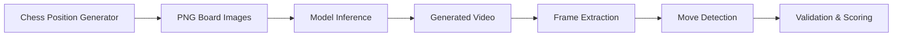

# Chess Reasoning Task Documentation

## Overview

The Chess Reasoning Task evaluates video generation models' ability to demonstrate strategic thinking and tactical pattern recognition by generating videos that show the solution to chess mate-in-1 positions. This task tests spatial reasoning, pattern recognition, strategic thinking, and precise action demonstration capabilities.

**Key Features:**
- Self-contained position generator with 150+ verified mate-in-1 positions
- No external chess database dependencies
- Built-in position validation using python-chess library
- Automatic board rendering to PNG format
- Standardized prompts for consistent evaluation
- Integration with VMEvalKit's multi-domain evaluation framework

## Quick Start

```bash
# 1. Clone the repository with submodules
git clone --recurse-submodules https://github.com/your-org/VMEvalKit.git
cd VMEvalKit

# 2. Install dependencies
pip install -r requirements.txt

# 3. Generate chess dataset (along with other domains)
python vmevalkit/runner/create_dataset.py --pairs-per-domain 50

# 4. Run inference on generated chess tasks
python vmevalkit/runner/inference.py --model gpt4o --task chess

# 5. Evaluate results
python vmevalkit/runner/evaluate.py --experiment chess_eval
```

## Task Types

### Mate-in-1 Tasks
- **Description**: Chess positions where one side can deliver checkmate in exactly one move
- **Visual Style**: Standard chess board with pieces in FEN notation
- **Goal**: Find and demonstrate the winning move that delivers immediate checkmate
- **Difficulty Levels**: Easy (basic patterns) → Medium (tactical patterns) → Hard (complex positions)
- **Pattern Types**: Back-rank mates, corner mates, queen/rook/knight tactics, discovered attacks

### Pattern Categories

#### Back-Rank Mates
- **Description**: King trapped on back rank by own pieces, attacked by rook/queen
- **Example**: `6k1/5ppp/8/8/8/8/8/R6K w - - 0 1` → Ra8#
- **Tags**: `["back_rank", "rook"]`

#### Queen Corner Mates  
- **Description**: Queen + King coordination against cornered enemy king
- **Example**: `6Qk/8/6K1/8/8/8/8/8 w - - 0 1` → Qh7#
- **Tags**: `["queen", "corner", "endgame"]`

#### Tactical Mates
- **Description**: Knight forks, discoveries, pins leading to mate
- **Example**: Various tactical motifs with immediate mate threats
- **Tags**: `["knight", "fork"]`, `["discovery"]`, `["pin"]`

## Example Positions

### Easy Example: Back-Rank Mate
```
Position (FEN): 6k1/5ppp/8/8/8/8/8/R6K w - - 0 1

Board Layout:
8 | . . . . . . k .
7 | . . . . . p p p
6 | . . . . . . . .
5 | . . . . . . . .
4 | . . . . . . . .
3 | . . . . . . . .
2 | . . . . . . . .
1 | R . . . . . . K
   a b c d e f g h

Solution: Ra8#
Explanation: The black king is trapped by its own pawns. White's rook delivers checkmate on a8.
```

### Medium Example: Queen and King Coordination
```
Position (FEN): 6Qk/8/6K1/8/8/8/8/8 w - - 0 1

Board Layout:
8 | . . . . . . Q k
7 | . . . . . . . .
6 | . . . . . . K .
5 | . . . . . . . .
4 | . . . . . . . .
3 | . . . . . . . .
2 | . . . . . . . .
1 | . . . . . . . .
   a b c d e f g h

Solution: Qh7#
Explanation: The white king supports the queen's checkmate delivery on h7.
```

### Hard Example: Smothered Mate Pattern
```
Position (FEN): 6rk/6pp/7N/8/8/8/8/7K w - - 0 1

Board Layout:
8 | . . . . . . r k
7 | . . . . . . p p
6 | . . . . . . . N
5 | . . . . . . . .
4 | . . . . . . . .
3 | . . . . . . . .
2 | . . . . . . . .
1 | . . . . . . . K
   a b c d e f g h

Solution: Nf7#
Explanation: The knight delivers a classic smothered mate, with the black king trapped by its own pieces.
```

## Data Structure

### Task Pair Format
Each task is stored as a dictionary matching VMEvalKit's standardized format:

```python
task_pair = {
    "id": "chess_0001",                    # Unique identifier
    "prompt": "White can deliver checkmate in one move. Show the winning move.",
    "first_image_path": "path/to/initial_position.png",
    "final_image_path": "path/to/final_position.png",
    "task_category": "Mate-in-1",
    "chess_data": {                        # Chess-specific metadata
        "initial_fen": "6k1/5ppp/8/8/8/8/8/R6K w - - 0 1",
        "final_fen": "R5k1/5ppp/8/8/8/8/8/6K b - - 0 1",
        "mate_move": "Ra8#",
        "all_mate_moves": ["Ra8#"],
        "piece_moved": "a1",
        "target_square": "a8",
        "is_capture": False,
        "gives_check": True,
        "pattern_description": "Classic back-rank mate"
    },
    "difficulty": "easy",
    "side_to_move": "white",
    "mate_moves": ["Ra8#"],               # All valid solutions
    "pattern_tags": ["back_rank", "rook"],
    "created_at": "2024-10-14T12:00:00Z"
}
```

### Dataset Structure
The complete dataset follows VMEvalKit's standardized format:

```python
dataset = {
    "name": "chess_tasks",
    "description": "Chess mate-in-1 reasoning tasks for video model evaluation (100 pairs)",
    "pairs": [task_pair_1, task_pair_2, ...],  # List of task pairs
    "metadata": {
        "version": "1.0.0",
        "created_at": "2024-10-14T12:00:00Z",
        "total_pairs": 100,
        "domains": ["chess_task"]
    }
}
```

### Position Data Structure
Internal position data generated by `SelfContainedMateGenerator`:

```python
puzzle_data = {
    "puzzle_id": "chess_0001",
    "fen": "6k1/5ppp/8/8/8/8/8/R6K w - - 0 1",  # FEN notation of position
    "side_to_move": "white",                     # "white" or "black"
    "mate_moves": ["Ra8#"],                      # List of valid mate moves (SAN)
    "difficulty": "easy",                         # "easy", "medium", or "hard"
    "description": "Rook back-rank mate",        # Human-readable description
    "tags": ["back_rank", "rook"]               # Pattern classification tags
}
```

## Visual Representation

### First Frame (Initial Position)
- Shows the chess board with the mate-in-1 position
- All pieces positioned according to the FEN string
- Standard chess board colors (light/dark squares)
- Clear piece distinction (white/black pieces)

### Final Frame (Solution)
- Shows the chess board after the mate move has been played
- The winning piece has moved to its target square
- Target square may be highlighted to show the move
- Position demonstrates checkmate has been achieved

### Board Rendering
- **Format**: PNG images (400x400 pixels by default)
- **Rendering Methods**:
  - **Primary**: Cairo-based SVG to PNG conversion (high quality)
  - **Fallback**: PIL-based rendering with Unicode chess symbols (♔♕♖♗♘♙)
- **Visual Style**:
  - Light squares: RGB(240, 217, 181)
  - Dark squares: RGB(181, 136, 99)
  - Unicode piece glyphs with outline for visibility
- **Dependencies**:
  - Required: `python-chess`, `Pillow`
  - Optional: `cairosvg` (for higher quality rendering)

## Prompts

### Prompt System

The chess task uses a centralized prompt system defined in `PROMPTS.py`:

```python
# From PROMPTS.py
PROMPTS = [
    "{side} can deliver checkmate in one move. Show the winning move.",  # Standard prompt
    # Additional prompt variations can be added here for experiments
]
DEFAULT_PROMPT_INDEX = 0
```

### Prompt Generation
- The system automatically determines the side to move from the FEN position
- `{side}` is replaced with "White" or "Black" accordingly
- Consistent prompting ensures fair comparison across models

### Examples
- **White to move**: "White can deliver checkmate in one move. Show the winning move."
- **Black to move**: "Black can deliver checkmate in one move. Show the winning move."

## Usage

### Command-Line Dataset Generation

The primary way to generate chess datasets is through the VMEvalKit dataset creation script:

```bash
# Generate complete VMEvalKit dataset with 50 chess tasks (among other domains)
python vmevalkit/runner/create_dataset.py --pairs-per-domain 50

# The chess tasks will be created in:
# data/questions/chess_task/
```

### Programmatic Generation

```python
from vmevalkit.tasks.chess_task import (
    SelfContainedMateGenerator,
    create_dataset,
    create_chess_task_pair,
    generate_chess_board_png
)

# Generate chess dataset
dataset = create_dataset(num_samples=100)

# Access generated task pairs
for pair in dataset['pairs']:
    print(f"Task: {pair['id']}")
    print(f"Prompt: {pair['prompt']}")
    print(f"Solution: {pair['mate_moves']}")

# Generate individual board image
generate_chess_board_png(
    fen="6k1/5ppp/8/8/8/8/8/R6K w - - 0 1",
    output_path="position.png",
    board_size=400  # Size in pixels
)

# Use the position generator directly
generator = SelfContainedMateGenerator()
positions = generator.generate_mate_positions(num_positions=150)
```

### Loading and Working with Datasets

```python
import json
from pathlib import Path

# Load the master dataset
with open("data/questions/vmeval_dataset.json", "r") as f:
    dataset = json.load(f)

# Filter chess tasks
chess_tasks = [p for p in dataset['pairs'] if 'chess' in p['id']]

# Access task data
for task in chess_tasks:
    print(f"ID: {task['id']}")
    print(f"Prompt: {task['prompt']}")
    print(f"Difficulty: {task['difficulty']}")
    print(f"Solutions: {task['mate_moves']}")
    
    # Load question metadata
    question_dir = Path(f"data/questions/chess_task/{task['id']}")
    with open(question_dir / "question_metadata.json", "r") as f:
        metadata = json.load(f)
    
    # Images are stored in the question directory
    first_image = question_dir / "first_frame.png"
    final_image = question_dir / "final_frame.png"
```

### Position Validation

The chess task system includes built-in validation during generation:

```python
import chess

# Validate a move is checkmate
board = chess.Board("6k1/5ppp/8/8/8/8/8/R6K w - - 0 1")
move = board.parse_san("Ra8#")

# Check if move is legal
if move in board.legal_moves:
    test_board = board.copy()
    test_board.push(move)
    
    # Check if it's checkmate
    if test_board.is_checkmate():
        print("Valid checkmate!")

# The SelfContainedMateGenerator automatically validates all positions:
# - Ensures moves are legal
# - Verifies checkmate is achieved
# - Filters out duplicate positions
# - Tests all proposed solutions
```

## File Structure

```
data/
└── questions/
    ├── vmeval_dataset.json           # Master dataset file
    └── chess_task/                   # Chess domain folder
        ├── chess_0000/                # Per-question folder
        │   ├── question_metadata.json # Task metadata
        │   ├── prompt.txt             # Task prompt
        │   ├── first_frame.png        # Initial position
        │   └── final_frame.png        # Solution position
        ├── chess_0001/
        │   ├── question_metadata.json
        │   ├── prompt.txt
        │   ├── first_frame.png
        │   └── final_frame.png
        └── ...
```

## Evaluation Criteria

Video models are evaluated on their ability to:

### Primary Capabilities
1. **Spatial Understanding**: Recognize chess board structure and piece positions
2. **Pattern Recognition**: Identify mate-in-1 tactical patterns
3. **Strategic Thinking**: Find the winning move among legal alternatives  
4. **Action Demonstration**: Generate clear piece movement in video
5. **Precision**: Execute exact piece movements accurately

### Evaluation Metrics
- **Move Accuracy**: Percentage of positions where model finds a correct mate move
- **Legal Move Rate**: Percentage of positions where model plays legal moves  
- **Pattern Recognition**: Success rate by pattern type (back-rank, corner, tactical)
- **Video Quality**: Clarity and accuracy of piece movement demonstration
- **Multiple Solution Handling**: Ability to find any correct mate (some positions have multiple solutions)

### Advanced Metrics
- **Difficulty Scaling**: Performance across easy/medium/hard positions
- **Color Balance**: Success with both white-to-move and black-to-move positions
- **Tactical Diversity**: Recognition across different piece types and patterns
- **Solution Completeness**: Whether full move sequence is clearly demonstrated

## Difficulty Levels

### Easy (70% of dataset)
- **Characteristics**: Basic mate patterns with clear solutions
- **Patterns**: Simple back-rank mates, basic queen/rook mates
- **Example**: `6k1/5ppp/8/8/8/8/8/R6K w - - 0 1` → Ra8#
- **Target**: Fundamental pattern recognition

### Medium (20% of dataset)  
- **Characteristics**: Tactical patterns requiring some analysis
- **Patterns**: Queen corner mates, knight forks, discovered attacks
- **Example**: Multiple solution positions, piece coordination
- **Target**: Strategic thinking and pattern analysis

### Hard (10% of dataset)
- **Characteristics**: Complex positions with subtle solutions
- **Patterns**: Advanced tactical motifs, multiple piece coordination
- **Example**: Positions requiring deep tactical understanding
- **Target**: Advanced pattern recognition and calculation

## Position Generation System

The chess task uses `SelfContainedMateGenerator` to create **150+ verified mate-in-1 positions**:

### Generation Methods

1. **Back-Rank Mates** (~50 positions)
   - Systematic combinations of king positions and pawn structures
   - Variations with rook and queen attacking pieces
   - Different file positions for the attacking piece

2. **Queen Corner Mates** (~30 positions)
   - Queen and king coordination patterns
   - Enemy king trapped in corners
   - Multiple queen approach angles

3. **Simple Piece Mates** (~20 positions)
   - Basic queen mates
   - Rook and king coordination
   - Two-rook patterns

4. **Rook Endgame Mates** (~15 positions)
   - Cutting off escape squares
   - Ladder mates
   - Box patterns

5. **Knight Mates** (~10 positions)
   - Smothered mates
   - Knight and queen coordination
   - Fork patterns leading to mate

6. **Position Variants** (doubles the collection)
   - Mirrored positions (horizontal/vertical)
   - Color-flipped positions
   - Rotated positions

### Quality Assurance
- **Automatic Validation**: Each position verified using python-chess
- **Deduplication**: FEN-based hash system prevents duplicates
- **Solution Verification**: All mate moves tested for legality and checkmate
- **Balanced Distribution**: Mix of white/black to move, various difficulty levels

## Integration with VMEvalKit

### Task Pipeline

The chess task integrates seamlessly with VMEvalKit's evaluation pipeline:



1. **Input Generation**
   - FEN positions converted to PNG board images
   - Initial and final positions generated for each task
   - Standardized prompts applied

2. **Model Inference**
   - Video models receive first frame + prompt
   - Generate video showing the solution
   - Output saved to model-specific directory

3. **Solution Extraction**
   - Extract frames from generated video
   - Identify piece movements between frames
   - Parse move in chess notation

4. **Validation**
   - Verify move legality using python-chess
   - Check if move achieves checkmate
   - Compare with expected solutions

5. **Scoring**
   - **Accuracy**: Correct mate move found
   - **Legality**: Move follows chess rules
   - **Quality**: Clear piece movement shown

### Expected Model Behavior

```
INPUT:
  - Image: data/questions/chess_task/chess_0001/first_frame.png
  - Prompt: "White can deliver checkmate in one move. Show the winning move."

MODEL GENERATION:
  - Frame 1: Shows initial board position
  - Frames 2-N: Animation of piece movement
  - Final Frame: Shows board after the mate move

OUTPUT:
  - Video: data/results/model_name/chess_0001_output.mp4
  - Extracted final position for validation

EVALUATION:
  ✅ Move Detected: Ra1→Ra8
  ✅ Legal Move: Yes
  ✅ Checkmate: Yes
  ✅ Score: 1.0
```

### Evaluation Modes

1. **Automatic (GPT-4O)**
   ```python
   python vmevalkit/runner/evaluate.py \
     --mode gpt4o \
     --experiment chess_eval
   ```

2. **Human Evaluation**
   ```python
   python vmevalkit/runner/evaluate.py \
     --mode human \
     --experiment chess_eval
   ```

3. **Custom Evaluation**
   - Implement custom logic for move extraction
   - Use python-chess for validation
   - Score based on task-specific criteria

## Notes

### Technical Implementation Details

#### Dependencies
- **python-chess**: Core chess logic and validation (included as submodule)
- **Pillow (PIL)**: Board rendering and image generation
- **cairosvg** (optional): High-quality SVG to PNG conversion

#### Key Components
- `chess_reasoning.py`: Main implementation file
- `SelfContainedMateGenerator`: Position generation class
- `create_dataset()`: Dataset creation function
- `generate_chess_board_png()`: Board rendering function
- `PROMPTS.py`: Centralized prompt management

#### Technical Specifications
- Positions stored in FEN (Forsyth-Edwards Notation)
- Moves in SAN (Standard Algebraic Notation)
- Images: 400x400 PNG format
- JSON serialization for dataset storage
- UTF-8 encoding for all text files

### Model Requirements
- **Visual Processing**: Ability to parse chess board images
- **Pattern Recognition**: Understanding of chess pieces and positions
- **Strategic Reasoning**: Capability to find winning moves
- **Video Generation**: Production of coherent piece movement videos
- **Precision**: Accurate representation of chess moves

### Current Limitations & Future Work

#### Limitations
- Limited to mate-in-1 positions (no multi-move sequences)
- Position variety focuses on common tactical patterns
- Board rendering limited to standard 2D representation
- No support for special moves in puzzles (en passant, castling)

#### Potential Enhancements
- Mate-in-2 or mate-in-3 positions for increased complexity
- More diverse tactical patterns (pins, skewers, discoveries)
- 3D board visualization options
- Alternative board styles and piece sets
- Integration with chess engines for dynamic position generation
- Support for chess variants (Chess960, etc.)

## Research Applications

The chess reasoning task enables research into:

- **Spatial Reasoning**: How models understand 2D board representations
- **Pattern Recognition**: Detection of tactical and strategic patterns
- **Planning**: Ability to identify optimal moves in goal-directed tasks
- **Action Demonstration**: Translation of understanding into video actions
- **Domain Transfer**: Application of reasoning across different problem domains
- **Compositional Understanding**: Recognition of piece interactions and combinations
- **Strategic Abstraction**: Understanding high-level concepts like "back-rank weakness"

## Troubleshooting

### Common Issues

1. **ImportError for chess module**
   ```bash
   # Ensure python-chess submodule is initialized
   git submodule update --init --recursive
   ```

2. **Poor quality board images**
   ```bash
   # Install cairosvg for better rendering
   pip install cairosvg
   ```

3. **Missing Unicode chess symbols**
   - Install a font with chess glyphs (e.g., DejaVu Sans)
   - Fallback to letter representation if glyphs unavailable

4. **Dataset generation fails**
   - Check write permissions in data/questions/ directory
   - Verify python-chess is properly installed
   - Ensure sufficient disk space for images

## See Also

- [VMEvalKit Main Documentation](../../../README.md)
- [Dataset Creation Guide](../../../docs/ADDING_TASKS.md)
- [Evaluation Documentation](../../../docs/EVALUATION.md)
- [python-chess Documentation](https://python-chess.readthedocs.io/)

This task provides a rigorous evaluation framework for assessing video models' reasoning capabilities in the strategic domain of chess, complementing existing spatial reasoning tasks like maze navigation.
